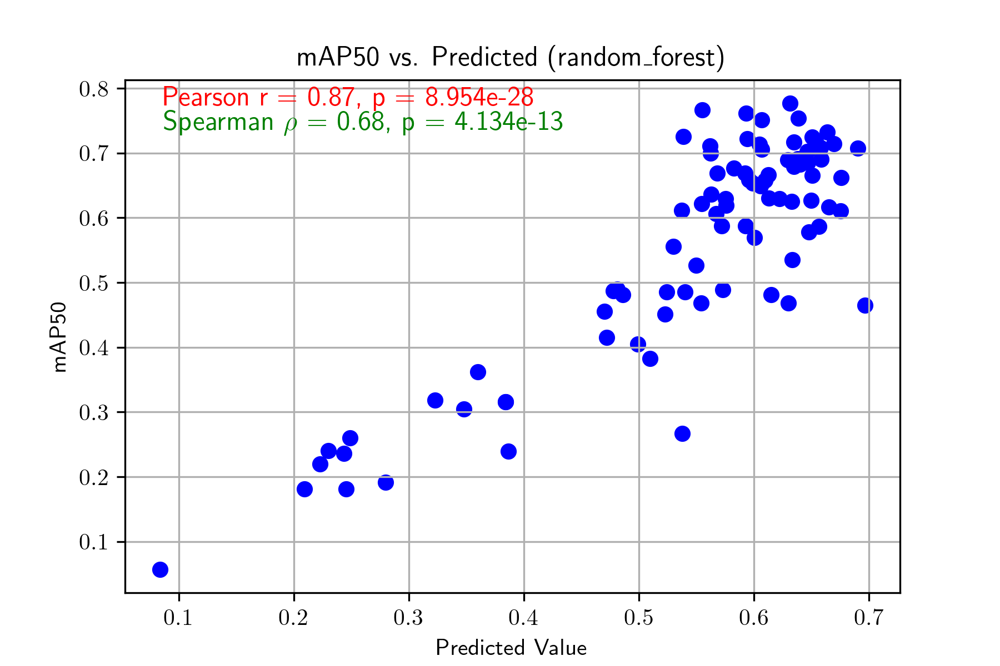

<p align="center">
  <h1 align="center">SDQM: Synthetic Data Quality Metric for Object Detection Dataset Evaluation</h1>
  <div align="center">
    <table>
      <tr>
        <td style="vertical-align: middle; width: 30%; padding-left: 15px; padding-right: 15px;">
          <table style="width: 100%; margin: 0 auto;">
            <thead>
              <tr>
                <th>Metric</th>
                <th>mAP50<br>Pearson<br>Correlation</th>
              </tr>
            </thead>
            <tbody>
              <tr>
                <td>α-Precision<sup>11</sup></td>
                <td>0.4477</td>
              </tr>
              <tr>
                <td>β-Recall<sup>11</sup></td>
                <td>0.5865</td>
              </tr>
              <tr>
                <td>Authenticity<sup>11</sup></td>
                <td>-0.3482</td>
              </tr>
              <tr>
                <td>MAUVE<sup>9</sup></td>
                <td>0.5651</td>
              </tr>
              <tr>
                <td><b>SDQM (ours)</b></td>
                <td><b>0.8719</b></td>
              </tr>
            </tbody>
            <tfoot>
              <tr>
                <td colspan="2" style="text-align: center; font-size: 0.9em; padding-top: 10px;">
                  <i>SDQM demonstrates superior correlation <br> with model performance compared to alternative metrics.</i>
                </td>
              </tr>
            </tfoot>
          </table>
        </td>
        <td style="vertical-align: middle; width: 70%; text-align: center;">
          
        </td>
      </tr>
    </table>
  </div>
  <p align="center">
    <a href="https://ayushzenith.me"><strong>Ayush Zenith</strong></a>
    ·
    <a href="#"><strong>Arnold Zumbrun</strong></a>
    ·
    <a href="#"><strong>Neel Raut</strong></a>
    ·
    <a href="#"><strong>Jing Lin</strong></a>
  </p>
  <h3 align="center">
    <a href="https://arxiv.org/pdf/" target="_blank">Paper</a> | <a href="https://github.com/ayushzenith/SDQM" target="_blank">Code</a> 
    <!-- | <a href="" target="_blank">Website (coming soon)</a>  -->
  </h3>
<br>

<h2 align="center">Abstract</h2>
<p align="left">
  The performance of machine learning models depends heavily on the quality of training data. Scarcity of large, well-annotated datasets poses significant challenges for building robust models. Synthetic data—generated via simulations and generative models—offers a promising solution by increasing dataset diversity and improving model performance, reliability, and resilience. However, evaluating the quality of synthetic data requires an effective metric.
  <br><br>
  <b>Synthetic Dataset Quality Metric (SDQM)</b> is introduced to assess data quality for object detection tasks without requiring full model training. SDQM enables efficient generation and selection of synthetic datasets, addressing key challenges in resource-constrained environments. In our experiments, SDQM showed a strong correlation with mean Average Precision (mAP) scores of YOLOv11, outperforming previous metrics that only achieved moderate or weak correlations. SDQM also provides actionable insights for improving dataset quality, reducing the need for costly iterative training. This scalable and efficient metric sets a new standard for evaluating synthetic data.
</p>
</p>


## Citation
If you found this code/work to be useful in your own research, please consider citing as follows:
```
```

## Introduction

This repository provides code to calculate each of SDQM's submetrics:

- MAUVE
- Frontier Integral
- V-Info
- α-Precision
- β-Recall
- Authenticity
- Cluster Metric
- Dataset Separability
- Spatial Distribution Difference
- Label Overlap
- Pixel Intensity Match
- Bounding Box Match

and the integrated super metric, SDQM.

## Installation

First, install the required packages:

```bash
cd SDQM
pip install -r requirements.txt
```

Then, install the customized ultralytics package:

```bash
cd dataset_interpretability/v_info/ultralytics
pip install -e .
```

## Getting the Data

### DIMO

The dimo dataset is available at <https://pderoovere.github.io/dimo/>.

To convert the DIMO dataset to YOLO format, use the `conversion/dimo_convert_to_yolo.py` script.

### RarePlanes

The RarePlanes dataset is available at <https://www.iqt.org/library/the-rareplanes-dataset>.

To convert the RarePlanes dataset to YOLO format, use the `conversion/rareplanes/run.py` script.

## Usage

To replicate the experiment conducted in the paper, use the `replicate_experiments.py` script.

The scripts takes in paths to the WASABI real and WASABI synthetic, RarePlanes real and RarePlanes synthetic, and DIMO real and DIMO synthetic datasets. The script will then split the datasets as necessary and perform evolutionary selection based on metric values, calculate SDQM, and perform regression on the SDQM values.

Example usage:

```bash
python3 replicate_experiments.py --wasabi_real_yolo_dir data/wasabi/real --wasabi_synthetic_yolo_dir data/wasabi/synthetic --rareplanes_real_yolo_dir data/rareplanes/real --rareplanes_synthetic_yolo_dir data/rareplanes/synthetic --dimo_real_yolo_dir data/dimo/real --dimo_synthetic_yolo_dir data/dimo/synthetic --output_dir data/experiment
```

## Scripts

This repository contains three main scripts: `sdqm.py`, `dataset_selection/select_datasets.py`, and `regression.py`,

### Calculating SDQM

The `sdqm.py` script calculates SDQM given a real and synthetic dataset pair.

### Evolutionarily Selecting Datasets

The `select_datasets.py` script selects the desired real and synthetic dataset pairs given a set of real and synthetic datasets. The script takes in the following arguments:

#### Dataset Configuration

- `--num_datasets`:   
  **Type:** `int`   
  **Default:** `1`   
  **Description:** Number of real dataset splits to create.

- `--input_yolo_dir`:  
  **Type:** `str`  
  **Default:** `"data/yolo"`  
  **Description:** Path to the real dataset YOLO directory.  

- `--synthetic_yolo_dir`:  
  **Type:** `str`  
  **Default:** `"data/yolo"`  
  **Description:** Path to the synthetic dataset YOLO directory.  

- `--output_dir`:  
  **Type:** `str`  
  **Default:** `"data"`  
  **Description:** Path to output the selected datasets.  

#### Model Configuration

- `--model_text`:  
  **Type:** `str`  
  **Default:** `"Vehicle"`  
  **Description:** Text to use for the grounding dino embedding model.  

#### Scene Function Selection

- `--scene_function`:  
  **Type:** `str`  
  **Choices:** `"wasabi_scene"`, `"rareplanes_real_scene"`, `"rareplanes_synthetic_scene"`, `"dimo_scene"`  
  **Description:** Scene function to use for splitting datasets.  

- `--synthetic_scene_function`:  
  **Type:** `str`  
  **Choices:** `"wasabi_scene"`, `"rareplanes_real_scene"`, `"rareplanes_synthetic_scene"`, `"dimo_scene"`  
  **Description:** Scene function to use for synthetic dataset splitting.  

#### Dataset Splits

- `--input_splits`:  
  **Type:** `str`  
  **Nargs:** `+`  
  **Default:** `["train", "val", "test"]`  
  **Description:** Splits from input datasets to use.  

- `--train_split`:  
  **Type:** `float`  
  **Description:** Train split proportion.  

- `--val_split`:  
  **Type:** `float`  
  **Description:** Validation split proportion.  

- `--test_split`:  
  **Type:** `float`  
  **Description:** Test split proportion.  

#### YOLO Configuration

- `--imgsz`:  
  **Type:** `int`  
  **Default:** `640`  
  **Description:** Image size for YOLO training.  

### Performing Regression on Datapoints

The `regression.py` script performs regression on SDQM datapoints from a CSV file.

Example usage:

```bash
python3 regression.py --input_path val.csv train.csv --output_path regression_output --all_methods --shuffle_split --last
```

The script takes in the following arguments:

#### Input and Output Paths

- `--input_path` (required):  
  **Type:** `str`  
  **Nargs:** `+`  
  **Description:** Path(s) to the input CSV file(s).  
  **Example:** `--input_path file1.csv file2.csv`

- `--val_input_path`:  
**Type:** `str`  
**Nargs:** `+`  
**Description:** Path(s) to the validation CSV file(s).  

- `--output_path`:  
**Type:** `str`  
**Description:** Path to the output directory.  

#### Data Configuration

- `--start_column`:  
**Type:** `int`  
**Description:** Column to start regression from.  

- `--y_column`:  
**Type:** `int`  
**Description:** Column to use as the target variable.  

- `--last`:  
**Action:** `store_true`  
**Description:** Use the last column as the target variable.  

### Results Handling

- `--load_results`:  
**Action:** `store_true`  
**Description:** Load `results.json` and calculate the Pearson coefficient with new data.  

#### Data Processing

- `--standardize`:  
**Action:** `store_true`  
**Description:** Standardize the input data.  

- `--pca`:  
**Type:** `int`  
**Default:** `None`  
**Description:** Number of principal components to keep.  

#### Regression Methods

- `--method`:  
**Type:** `str`  
**Default:** `linear`  
**Choices:** `linear`, `ridge`, `lasso`, `decision_tree`, `random_forest`, `xgboost`, `svr`  
**Description:** Regression method to use.  

- `--all_methods`:  
**Action:** `store_true`  
**Description:** Run all regression methods.  

#### Data Splitting

- `--shuffle_split`:  
**Action:** `store_true`  
**Description:** Shuffle and split data into train and validation sets.  

- `--test_size`:  
**Type:** `float`  
**Default:** `0.2`  
**Description:** Proportion of data to use as the test set.  

- `--k_folds`:  
**Type:** `int`  
**Default:** `None`  
**Description:** Number of folds for k-fold cross-validation.  

#### Feature Analysis

- `--feature_removal_test`:  
**Action:** `store_true`  
**Description:** Remove each feature one by one and measure the effect on correlation coefficients.  

- `--correlation_threshold`:  
**Type:** `float`  
**Default:** `None`  
**Description:** Remove features whose absolute Pearson correlation with the target is below this threshold.  

- `--sequential_test`:  
**Type:** `int`  
**Default:** `None`  
**Description:** Perform sequential feature selection test.  

#### Scaling Options

- `--scaler`:  
**Type:** `str`  
**Default:** `None`  
**Description:** Path to a saved `StandardScaler` object.  

- `--separately_scale`:  
**Action:** `store_true`  
**Description:** Standardize each CSV file separately.


## Acknowledgments

We acknowledge the AFRL Internship Program to support Ayush Zenith, Arnold Zumbrun, and Neel Raut's work. This material is based upon work supported by the Air Force Research Laboratory under agreement number FA8750-20-3-1004. Any opinions, findings, conclusions, or recommendations expressed in this publication are those of the authors and do not necessarily reflect the views of the U.S. Air Force. The U.S. Government is authorized to reproduce and distribute reprints for Governmental purposes notwithstanding any copyright notation thereon.

Approved for Public Release; Distribution Unlimited: AFR/PA Case No. AFRL-2025-4672.
